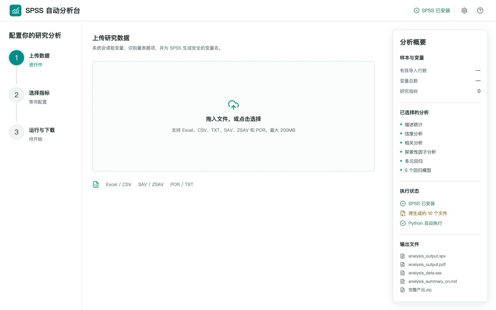

# SPSS Auto Analysis Workbench

> A beginner-friendly local web application that turns research datasets into reproducible IBM SPSS analysis workflows.



SPSS Auto Analysis Workbench helps students and researchers analyse survey data without repeatedly navigating SPSS menus. Upload an Excel, CSV, or SPSS file, choose constructs and statistical procedures in a visual interface, then let the application prepare the data, generate embedded-Python SPSS syntax, launch SPSS, and organise the downloadable outputs.

The interface is currently provided in Chinese for accessibility to the project's primary users.

## What It Does

- Imports `.xlsx`, `.xls`, `.xlsm`, `.csv`, `.tsv`, `.txt`, `.sav`, `.zsav`, and `.por` files.
- Detects multi-item constructs from variable names such as `FQ1`, `FQ2`, and `PU_3`.
- Lets users review constructs, choose items, and configure analyses visually.
- Runs descriptive statistics, Cronbach's alpha, Pearson correlation, KMO and Bartlett tests, exploratory factor analysis, and multiple linear regression.
- Generates an SPSS embedded-Python driver that calls `spss.Submit()` with reproducible SPSS syntax.
- Produces prepared data, syntax, diagnostic tables, run metadata, and a ZIP download bundle.
- Reports missing SPSS installations, licensing problems, and macOS automation-permission issues in plain language.

## Why It Exists

Many first-time researchers know which statistical method they need but find SPSS's menu sequence, variable configuration, and output management difficult. This project turns that workflow into four guided steps:

1. Upload a dataset.
2. Confirm variables and constructs.
3. Select analyses and regression models.
4. Run the workflow and download the outputs.

The Python preview is a diagnostic aid. Formal inferential conclusions should be based on the `.spv` or PDF output produced by a licensed IBM SPSS Statistics installation.

## Architecture

```text
React + Vite interface
        |
        v
Flask job API
        |
        +-- pandas / NumPy data preparation and diagnostics
        |
        +-- generated SPSS embedded-Python driver
                    |
                    v
          spss.Submit() -> SPSS output files
        |
        v
Downloadable result bundle
```

## Quick Start

### Requirements

- macOS
- Python 3.9 or newer (Python 3.12 is the reference CI version)
- Node.js 20 or newer
- IBM SPSS Statistics with a valid licence for official `.spv`, PDF, and `.sav` outputs

### Launch

```bash
git clone https://github.com/lzy2767865503-pixel/spss-auto-workflow.git
cd spss-auto-workflow
chmod +x start.command
./start.command
```

The launcher creates a local Python environment, installs dependencies, builds the frontend, starts the API, and opens:

`http://127.0.0.1:8765`

For a non-standard SPSS installation or port:

```bash
SPSS_APP_PATH="/Applications/IBM SPSS Statistics/IBM SPSS Statistics.app" \
SPSS_AUTO_PORT=8766 \
./start.command
```

The first automatic SPSS run may require macOS permission under **System Settings > Privacy & Security > Accessibility**.

## Reproduce Without SPSS

The repository includes a synthetic survey fixture, backend tests, a locked
frontend dependency tree, and an automated verification script. This path does
not need IBM SPSS or any private research data:

```bash
./scripts/verify.sh
```

The script creates an isolated Python environment, installs the declared
dependencies, runs the backend and API tests, installs the exact frontend
dependency versions from `package-lock.json`, and produces a production build.

See [REPRODUCIBILITY.md](REPRODUCIBILITY.md) for the three verification levels:
self-contained validation, local Python preview, and licensed SPSS execution.

## Development

Backend:

```bash
python3 -m venv .venv
. .venv/bin/activate
python -m pip install --upgrade pip
.venv/bin/pip install -r requirements.lock.txt
.venv/bin/python backend/app.py
```

Frontend:

```bash
cd frontend
npm ci
npm run dev
```

Production build:

```bash
cd frontend
npm run build
```

## Privacy

- The application runs on `127.0.0.1` and does not upload research data to a cloud service.
- Uploaded datasets and generated jobs are stored under `data/jobs/`.
- `data/jobs/`, virtual environments, frontend dependencies, and local design files are excluded from Git.
- Do not commit respondent-level data, personally identifiable information, or confidential research material.

## Limitations

- Automatic SPSS launching currently targets macOS.
- IBM SPSS Statistics is proprietary software and is not included in this repository.
- Official SPSS output depends on an installed, activated, and licensed SPSS environment.
- Researchers remain responsible for checking assumptions, choosing appropriate methods, and interpreting results.

## Author

**LAI ZEYU**  
Business Administration undergraduate, Universiti Kebangsaan Malaysia  
GitHub: [lzy2767865503-pixel](https://github.com/lzy2767865503-pixel)

## License

Released under the [MIT License](LICENSE).
